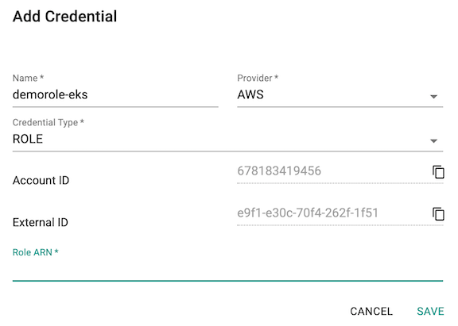
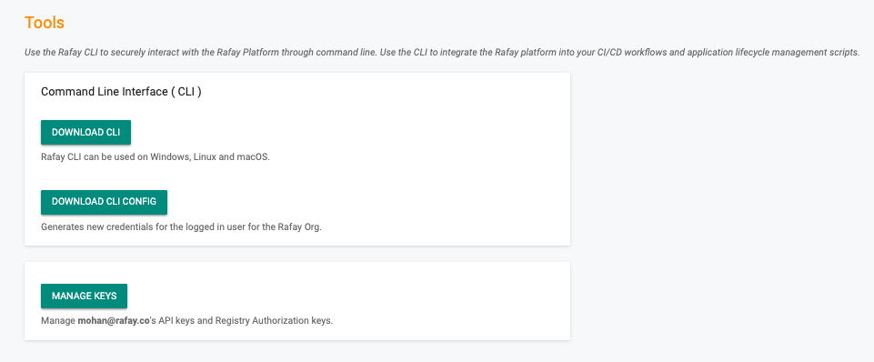
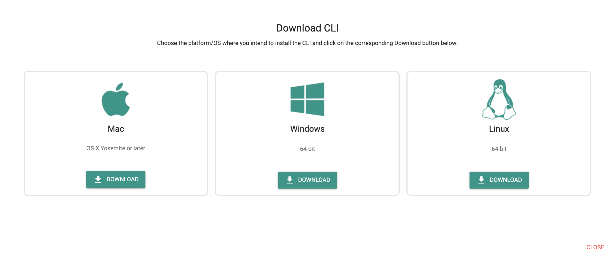

## What Will You Do

This is part 1 of a multi-part workshop. In this section, you will perform a few "one-time" tasks required to connect a Rafay account to an AWS account along with additional setup of tools that will be used throughout the workshop. 

---

## Step 1: Create Cloud Credentials 

Cloud credentials provide privileges to programmatically interact with your Amazon AWS account so that the lifecycle of infrastructure associated with the Amazon EKS cluster can be managed by Rafay's Kubernetes Operations Platform. 

- Login to the Rafay Console with the credentials provided and click on Infrastructure

- Select "Cloud Credentials", Click on "New Credential" and provide a unique name "aws-workshop-x" where x aligns with your Rafay user.

- Input the ARN that has been provided with your Rafay and AWS credentials into the External ID box.



- Provide the name created above "aws-workshop-x" for the cloud credential.  Note: The specification files will need to be updated to match the unique name.
---

## Step 2: Download RCTL

The RCTL CLI allows you to programmatically interact with the controller enabling users to construct sophisticated automation workflows. 

- On the left panel of the admin console, click on "My Tools".
- Click on the "Download CLI" button and download the package for your operating system
- Unzip the downloaded package into a folder (for example: “rctl”).





---

## Initialize RCTL
  
The RCTL utility needs to be initialized with credentials and other information before it can interact with the Controller. At a given time, RCTL can be initialized with only one configuration. It can always be reinitialized if it needs to be bound to a different Org/Tenant.

Note: that the RBAC associated with the user's credentials is automatically enforced.

RCTL supports both a "config file" as well as "dynamic config" model. The latter is well suited for automation pipelines where the configuration is provided dynamically and there is no need to permanently bind RCTL to an Org or Project. For today's workshop, we will use a "config file".

### RCTL Config File
- Navigate to the "My Tools" page in the Web Console
- Click on __Download CLI Config__ to download the configuration file.
- Save the configuration file on your system


## Setting Path for RCTL 

After installing the RCTL CLI, follow the steps below to add it to your OS's PATH environment variable. 

### macOS and Linux 

export PATH=$PATH:<folder where you unzipped RCTL> 

### Windows

- Press the Windows key and enter environment variables.
- From the list of suggestions, choose Edit environment variables for your account.
- Choose PATH, and then choose Edit.
- Add the path you found in the first step into the Variable value field, for example, C:\rctl\rctl.exe.
- Choose OK twice to apply the new settings.
- Close any running command prompts and reopen the command prompt window.

## View RCTL Config

You can view the current configuration for RCTL by using the "config show" command.

```
./rctl config show

Profile:                                                                    prod
REST Endpoint:                                                 console.rafay.dev
OPS Endpoint:                                                      ops.rafay.dev
API Key:                                                            <Masked>
API Secret:                                                         <Masked>
Project:                                                          defaultproject
```

---

## Projects

Projects are a way to implement multi tenancy within an Organization and implement true isolation boundaries. 

!!! Note
    Creation and Deletion of Projects are privileged operations. This is typically performed by an Org Admin using the Web Console because RBAC assignments also need to be implemented along with this.

---

### Default Project

By default, the RCTL config points to the "defaultproject". You can verify this by viewing the config.

```
rctl config show
```

---

### Set Project

For this workshop each person will have their own project that will be provided along with the credentials. This step will ensure that you set the project context before you can perform operations in this project. For example, to set the project context to your Rafay project provided in the workshop

```
rctl config set project aws-workshop-x
```

Once the project context has been successfully set, ensure you verify this in your local config file.


!!! Note
    The name of the project is case-sensitive

---

## Step 3: Clone Git Repo 

Declarative specs for the Amazon EKS cluster and other resources are available in a [Git repository](https://github.com/RafaySystems/getstarted)

- Clone the Git repository to your laptop using the command below. 

```
git clone https://github.com/RafaySystems/getstarted.git
```

- Once complete, you should see a folder called "cloudwatch" which contains the specs needed for this guide. 

--- 

## Recap

At this point, you have everything setup and configured for the workshop.

---
