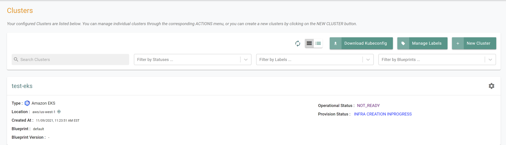
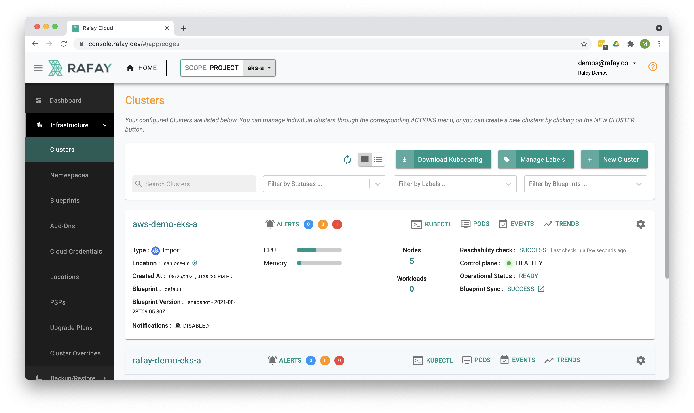

## What Will You Do

This is part 2 of a multi-part workshop.  In this section of the workshop you will provision a new Amazon EKS cluster and import an existing Amazon EKS cluster.

---

## Step 1: Configure and Provision Amazon EKS Cluster

In this step, you will configure and customize your Amazon EKS Cluster specification using a YAML based cluster specification.

This will provision an EKS cluster with the following configuration:

- A private (cloaked) EKS control plane in the us-west-1 region
- New VPCs and Subnets will be auto created
- A managed node group with two worker nodes based on t3.large instance type
- gp3 storage volumes and Amazon Linux2 OS
- IAM roles for ASG and ECR access enabled  
- Default cluster blueprint (Monitoring, Log Aggregation enabled)

Provisioning will take approximately 40 minutes to complete. The final step in the process is the blueprint sync for the default blueprint. This can take a few minutes to complete because this requires the download of several container images and deployment of monitoring and log aggregation components.

- Save the below specification file to your computer as "eks-cluster-basic.yaml"

``` yaml
kind: Cluster
metadata:
  labels:
    env: dev
    type: eks-workloads
  name: test-eks
  project: aws-workshop
spec:
  type: eks
  cloudprovider: dev-aws
  blueprint: default
---
apiVersion: rafay.io/v1alpha5
kind: ClusterConfig

metadata:
  name: test-eks
  region: us-west-1
  tags:
    'demo': 'true'

managedNodeGroups:
  - name: ng-1
    instanceType: t3.large
    desiredCapacity: 2
```

Update the following sections of the specification file with details to match your environment

- Update the project section with the name of the project in your organization
``` yaml
    project: aws-workshop
```

- Update the cloudprovider section with the name of the cloud credential that was previously created
``` yaml
    cloudprovider: dev-aws
```

- Execute the following command to provision the cluster from the specification file previously defined
```
./rctl apply -f eks-cluster-basic.yaml
```
***Expected output (with a task id):***

```
Cluster: test-eks
{
  "taskset_id": "d2wg4k8",
  "operations": [
    {
      "operation": "NodegroupCreation",
      "resource_name": "ng-1",
      "status": "PROVISION_TASK_STATUS_PENDING"
    },
    {
      "operation": "ClusterCreation",
      "resource_name": "test-eks",
      "status": "PROVISION_TASK_STATUS_PENDING"
    }
  ],
  "comments": "The status of the operations can be fetched using taskset_id",
  "status": "PROVISION_TASKSET_STATUS_PENDING"
}
```

To retrieve the status of the apply operation, enter the below command with the generated task id
```
./rctl status apply d2wg4k8
```

***Expected Output***

```
{
  "taskset_id": "d2wg4k8",
  "operations": [
    {
      "operation": "NodegroupCreation",
      "resource_name": "ng-1",
      "status": "PROVISION_TASK_STATUS_PENDING"
    },
    {
      "operation": "ClusterCreation",
      "resource_name": "test-eks",
      "status": "PROVISION_TASK_STATUS_INPROGRESS"
    }
  ],
  "comments": "Configuration is being applied to the cluster",
  "status": "PROVISION_TASKSET_STATUS_INPROGRESS"
}
```

- Login to the web console and view the cluster being provisioned



Once the cluster finishes provisioning, download the cluster configuration file and compare it to the specification file used to create the cluster.  The two files will match.

- Go to Clusters -> Infrastructure.  
- Click on the Settings Icon for the newly created cluster and select "Download Cluster Config"


---

### Step 2 : Import an existing Amazon EKS Cluster

In this step, you will import an existing Amazon EKS cluster

- Save the following into a file such as create_import.sh. 
- Update the CLUSTER_NAME with the name of the existing AWS EKS Cluster that was provided to you with your credentials.  This script will import the EKS cluster into the project in a single step making it well suited for embedding into your automation platform. 

```
CLUSTER_NAME="aws-workshop-eks"

./rctl create cluster imported $CLUSTER_NAME -p eks > $CLUSTER_NAME-bootstrap.yaml
sleep 30
export KUBECONFIG="${PWD}/${CLUSTER_NAME}/${CLUSTER_NAME}-eks-cluster.kubeconfig"
kubectl apply -f $CLUSTER_NAME-bootstrap.yaml
```

- Execute the bash file. The cluster import process can also take a few minutes to complete. 

```
bash create_import.sh 
```

You can monitor progress/status by checking whether the required namespaces have been created and the state of k8s resources in these namespaces. 

``` hl_lines="13 14"
NAME                                STATUS   AGE
capi-kubeadm-bootstrap-system       Active   2d21h
capi-kubeadm-control-plane-system   Active   2d21h
capi-system                         Active   2d21h
capi-webhook-system                 Active   2d21h
capv-system                         Active   2d21h
cert-manager                        Active   2d21h
default                             Active   2d21h
eks-system                          Active   2d21h
kube-node-lease                     Active   2d21h
kube-public                         Active   2d21h
kube-system                         Active   2d21h
rafay-infra                         Active   2d19h
rafay-system                        Active   2d19h
```

Once this step is complete, you should be able to view the cluster in the web console. 



---

## Recap

Congratulations! At this point, you have

- Successfully configured and provisioned an Amazon EKS cluster and imported an existing Amazon EKS Cluster. 

---
