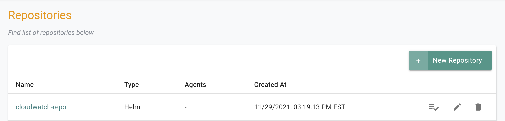
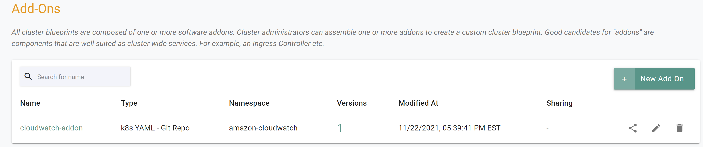
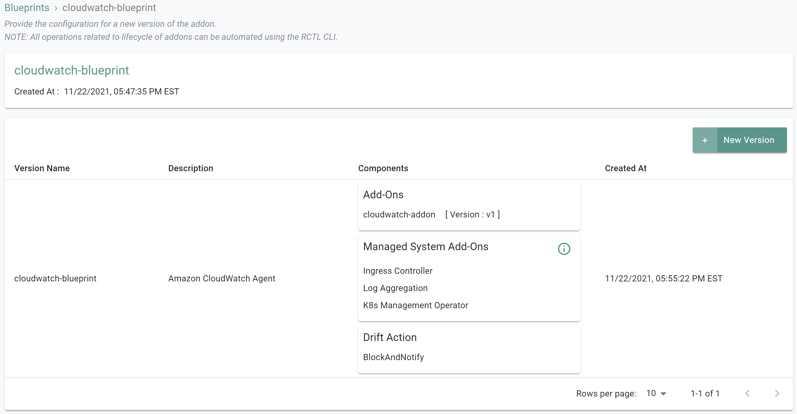

## What Will You Do

This is part 5 of a multi-part workshop.  In this section of the workshop you will create a custom cluster blueprint with a [Amazon CloudWatch Agent](https://docs.aws.amazon.com/AmazonCloudWatch/latest/monitoring/WhatIsCloudWatch.html) add-on, based on declarative specifications. 

---

## Step 1: Create Repository  

In this step, you will create a repository in your project so that the controller can retrieve the Helm charts automatically. 

- Open Terminal (on macOS/Linux) or Command Prompt (Windows) and navigate to the folder where you forked the Git repository 
- Navigate to the folder "<your folder>/getstarted/cloudwatch/repository"

The "cloudwatch-repository.yaml" file contains the declarative specification for the repository. In this case, the specification is of type "Helm Repository" and the "endpoint" is pointing to the AWS Github repository that includes the CloudWatch Helm chart. 

```yaml hl_lines="6 7"
apiVersion: config.rafay.dev/v2
kind: Repository
metadata:
  name: cloudwatch-repo
spec:
  repositoryType: HelmRepository
  endpoint:  https://aws.github.io/eks-charts
  credentialType: CredentialTypeNotSet
```

Type the command below 

```
rctl create repository -f cloudwatch-repository.yaml
```

If you did not encounter any errors, you can optionally verify if everything was created correctly on the controller.

- Navigate to your aws-workshop project in your Org
- Select Integrations -> Repositories



---

## Step 2: Create Addon

In this step, you will create a custom addon for the Cloudwatch Agent. The "cloudwatch-addon.yaml" file contains the declarative specification

If you plan to use a different name for the cluster other than "cloudwatch-cluster", you must update the "custom-values.yaml" file located in the folder "<your folder>/getstarted/cloudwatch/addon" with the name of the cluster

The following details are used to build the declarative specification.

- "v1" because this is our first version
- Name of addon is "cloudwatch-addon" 
- The addon will be deployed to a namespace called "amazon-cloudwatch"
- You will be using a custom "custom-values.yaml as an override which is located in the folder "<your folder>/getstarted/cloudwatch/addon"  
- The "aws-cloudwatch-metrics" chart will be used from the previously created repository named "cloudwatch-repo"

The following items may need to be updated/customized if you made changes to these or used alternate names. 

- project: "aws-workshop-xx"

```yaml hl_lines="4"
kind: AddonVersion
metadata:
  name: v1
  project: aws-workshop-xx
spec:
  addon: cloudwatch-addon
  namespace: amazon-cloudwatch
  template:
    type: Helm3
    valuesFile: custom-values.yaml
    repository_ref: cloudwatch-repo
    repo_artifact_meta:
      helm:
       chartName: aws-cloudwatch-metrics
```

- Open Terminal (on macOS/Linux) or Command Prompt (Windows) and navigate to the folder where you forked the Git repository 
- Navigate to the folder "<your folder>/getstarted/cloudwatch/addon"
- Type the command below 

```
rctl create addon version -f cloudwatch-addon.yaml
```

If you did not encounter any errors, you can optionally verify if everything was created correctly on the controller.

- Navigate to the "defaultproject" project in your Org
- Select Infrastructure -> Addons 
- You should see an addon called "cloudwatch-addon"



---

## Step 3: Create Blueprint

In this step, you will create a custom cluster blueprint with the CloudWatch addon. The "cloudwatch-blueprint.yaml" file contains the declarative specification. 

- Open Terminal (on macOS/Linux) or Command Prompt (Windows) and navigate to the folder where you forked the Git repository 
- Navigate to the folder "<your folder>/getstarted/cloudwatch/blueprint"  

The following items may need to be updated/customized if you made changes to these or used alternate names. 

- project: "aws-workshop-xx"

```yaml hl_lines="6"
kind: Blueprint
metadata:
  # blueprint name
  name: cloudwatch-blueprint
  #project name
  project: aws-workshop-xx"
```

- Type the command below 

```
rctl create blueprint -f cloudwatch-blueprint.yaml
```

If you did not encounter any errors, you can optionally verify if everything was created correctly on the controller.

- Navigate to the "aws-workshop-xx" project in your Org
- Select Infrastructure -> Blueprint 
- You should see an blueprint called "cloudwatch-blueprint


---

###  New Version

Although we have a custom blueprint, we have not provided any details on what it comprises. In this step, you will create and add a new version to the custom blueprint. The YAML below is a declarative spec for the new version.  

The following items may need to be updated/customized if you made changes to these or used alternate names. 

- project: "aws-workshop-xx"

```yaml hl_lines="4"
kind: BlueprintVersion
metadata:
  name: v1
  project: aws-workshop-xx
  description: Amazon CloudWatch Agent
spec:
  blueprint: cloudwatch-blueprint
  baseSystemBlueprint: default
  baseSystemBlueprintVersion: ""
  addons:
    - name: cloudwatch-addon
      version: v1
  # cluster-scoped or namespace-scoped
  pspScope: cluster-scoped
  rafayIngress: true
  rafayMonitoringAndAlerting: false
  kubevirt: false
  # BlockAndNotify or DetectAndNotify
  driftAction: BlockAndNotify
```

- Type the command below to add a new version

```
rctl create blueprint version -f cloudwatch-blueprint-v1.yaml
```

If you did not encounter any errors, you can optionally verify if everything was created correctly on the controller.

- Navigate to the "aws-workshop-xx"  project in your Org
- Select Infrastructure -> Blueprint 
- Click on the "cloudwatch-blueprint" custom cluster blueprint 



---

## Step 4: Update Cluster Blueprint

Once the cluster that was built from a spec file is finished provisioning, we can apply the blueprint to the cluster.  We will use rctl to apply the updated blueprint to the cluster.

- In the left hand pane of the Cloud9 instance, open the file named "eks-cluster-basic.yaml" for editing
- Update the cluster blueprint section with the name of the newly created blueprint, "cloudwatch-blueprint"
- Add the blueprint version to spec file

``` yaml
    blueprint: cloudwatch-blueprint
    blueprintversion: v1
```

- Save the file
- The updated spec should look similar to the following

``` yaml
kind: Cluster
metadata:
  name: cloudwatch-cluster
  project: aws-workshop-xx
  labels:
    env: dev
    type: eks-workloads
spec:
  blueprint: cloudwatch-blueprint
  blueprintversion: v1
  cloudprovider: dev-aws
  cniprovider: aws-cni
  type: eks
---
apiVersion: rafay.io/v1alpha5
kind: ClusterConfig
metadata:
  name: cloudwatch-cluster
  region: us-east-1
  tags:
    'demo': 'true'
  version: "1.20"
managedNodeGroups:
  - name: ng-1
    instanceType: t3.large
    desiredCapacity: 2
    iam:
     withAddonPolicies:
      albIngress: true
      autoScaler: true
      efs: true
      cloudWatch: true
```

- Execute the following command to update the cluster from the specification file previously defined

```
rctl apply -f eks-cluster-basic.yaml
```

***Expected output (with a task id):***

```
{
  "taskset_id": "dk69p0k",
  "operations": [
    {
      "operation": "BlueprintUpdation",
      "resource_name": "cloudwatch-cluster",
      "status": "PROVISION_TASK_STATUS_PENDING"
    }
  ],
  "comments": "The status of the operations can be fetched using taskset_id",
  "status": "PROVISION_TASKSET_STATUS_PENDING"
}
```

## Recap

As of this step, you have created a "cluster blueprint" with the CloudWatch agent as one of the addons.

Note that you can also reuse this cluster blueprint for as many clusters as you require in this project and also share the blueprint with other projects. 

---
