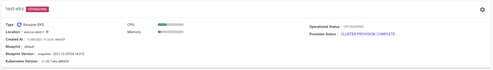
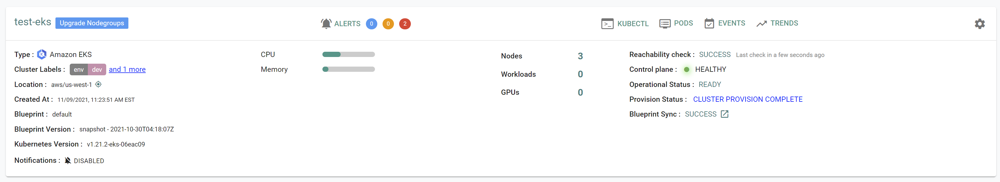
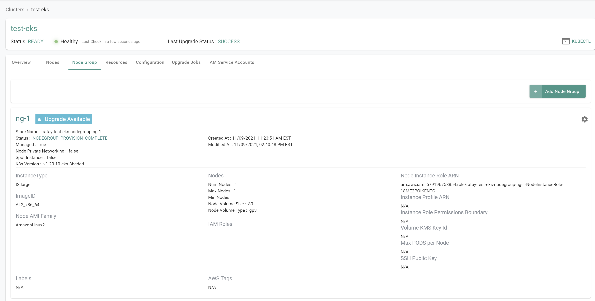
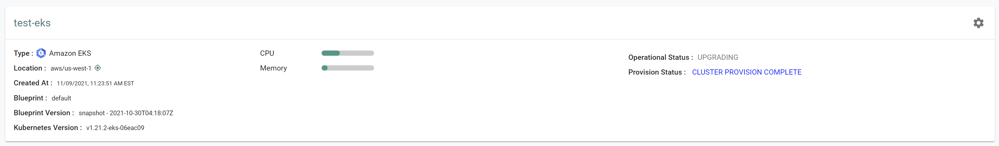
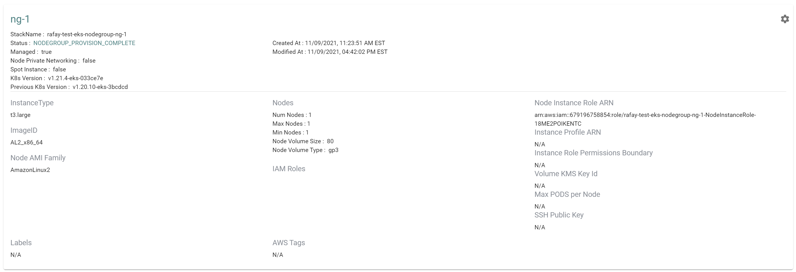

## What Will You Do

This is part 8 of a multi-part workshop. In this section you will: 

- Upgrade the control plane kubernetes version
- Upgrade the worker nodes kubernetes version


---

## Assumptions

!!! Note
    The instructions describe the process using the RCTL CLI. The same steps can be performed using the web console.

---

## Step 1: Upgrade Control Plane

In this step, we will upgrade the kubernetes version for the control plane of the cluster.

Confirm the current control plane version of the cluster

- Go to Infrastructure -> Clusters and view the current version of the control plane


Download the current cluster config from the existing cluster

- Go to Infrastructure -> Clusters. Click on the settings icon of the cluster and select "Download Cluster Config"
- Update the downloaded specification file with the desired control plane version

``` yaml
metadata:
  name: test-eks
  version: "1.21"
```

The updated YAML file will look like this:

``` yaml hl_lines="23"
kind: Cluster
metadata:
  labels:
    env: dev
    type: eks-workloads
  name: test-eks
  project: aws
spec:
  blueprint: default
  cloudprovider: dev-aws
  type: eks
---
apiVersion: rafay.io/v1alpha5
kind: ClusterConfig
managedNodeGroups:
- desiredCapacity: 1
  instanceType: t3.large
  maxSize: 1
  minSize: 1
  name: ng-1
metadata:
  name: test-eks
  version: "1.21"
  region: us-west-1
  tags:
    demo: "true"
vpc:
  clusterEndpoints:
    privateAccess: true
    publicAccess: false

```

- Execute the following command to begin the upgrade of the control plane version

```
./rctl apply -f eks-test-config.yaml
```
***Expected output (with a task id):***

```
Cluster: test-eks
{
  "taskset_id": "3mxdjkr",
  "operations": [
    {
      "operation": "ClusterUpgrade",
      "resource_name": "test-eks",
      "status": "PROVISION_TASK_STATUS_PENDING"
    }
  ],
  "comments": "The status of the operations can be fetched using taskset_id",
  "status": "PROVISION_TASKSET_STATUS_PENDING"
}

```

From the web console, we can see that the ugprade is in progress.  Note that the upgrade can take up to 40 minutes to complete.



Once the upgrade is complete, we can see that the kubernetes version of the cluster control plane has been upgraded.  Note that an upgrade for the nodegroup versions will still be available.  This will be updated in the next step.




---

## Step 2: Upgrade Node Group

In this step, we will upgrade the kubernetes version for the worker nodes in the cluster.

Confirm the current version of the nodes in the cluster

- Go to Infrastructure -> Clusters, click on the cluster -> Node Group and view the K8's Version



Download the current cluster config from the existing cluster

- Go to Infrastructure -> Clusters. Click on the settings icon of the cluster and select "Download Cluster Config"
- Update the downloaded specification file with the desired control plane version


``` yaml
managedNodeGroups:
  name: ng-1
  version: "1.21"
```
The updated YAML file will look like this:

``` yaml hl_lines="27"
kind: Cluster
metadata:
  labels:
    env: dev
    type: eks-workloads
  name: test-eks
  project: aws
spec:
  blueprint: default
  cloudprovider: dev-aws
  type: eks
---
apiVersion: rafay.io/v1alpha5
kind: ClusterConfig
managedNodeGroups:
- desiredCapacity: 1
  instanceType: t3.large
  maxSize: 1
  minSize: 1
  name: ng-1
  version: "1.21"
metadata:
  name: test-eks
  region: us-west-1
  tags:
    demo: "true"
  version: "1.21"
vpc:
  clusterEndpoints:
    privateAccess: true
    publicAccess: false

```

- Execute the following command to begin the upgrade of the worker node kubernetes version

```
./rctl apply -f eks-test-config.yaml
```
***Expected output (with a task id):***

```
Cluster: test-eks
{
  "taskset_id": "pkv1gkn",
  "operations": [
    {
      "operation": "NodegroupUpgrade",
      "resource_name": "ng-1",
      "status": "PROVISION_TASK_STATUS_PENDING"
    }
  ],
  "comments": "The status of the operations can be fetched using taskset_id",
  "status": "PROVISION_TASKSET_STATUS_PENDING"
}

```

From the web console, we can see that the ugprade is in progress.  Note that the upgrade can take up to 15 minutes to complete.



Once the upgrade is complete, we can see that the kubernetes version of the node groups have been upgraded.




---

## Recap

Congratulations! At this point, you have

- Successfully upgraded the control plane version of the cluster through the CLI
- Successfully upgraded a self managed node group through the CLI

---
