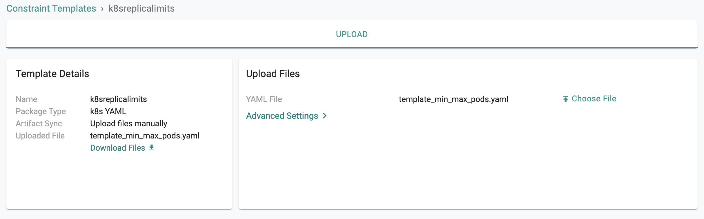
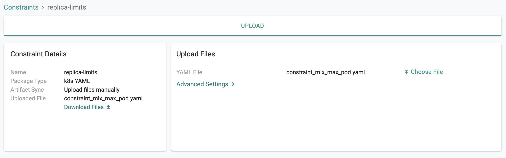
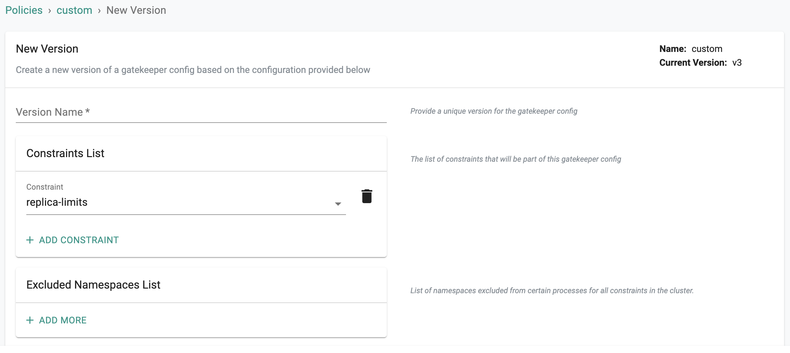
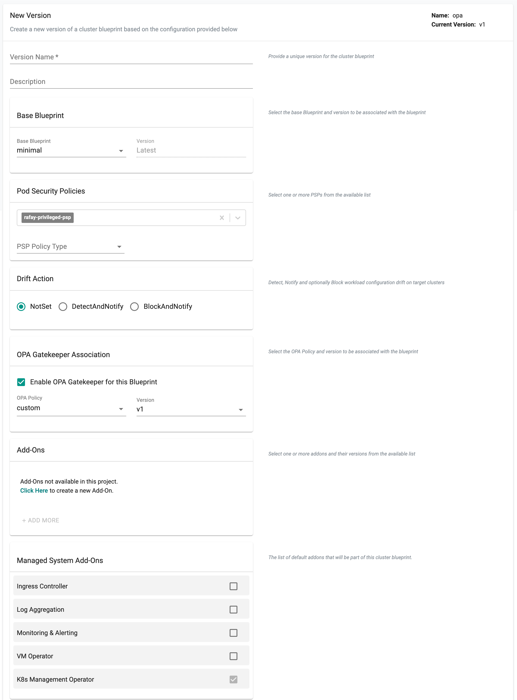
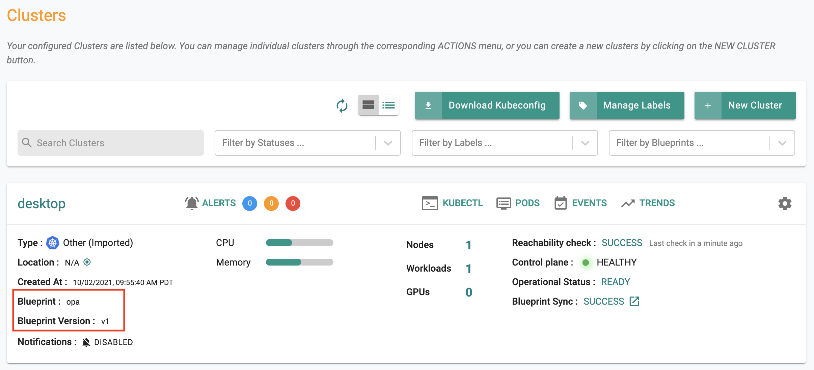
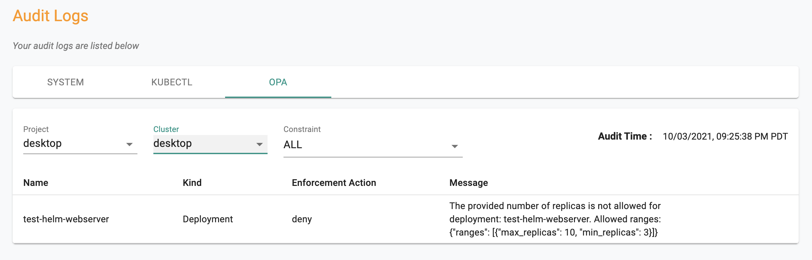
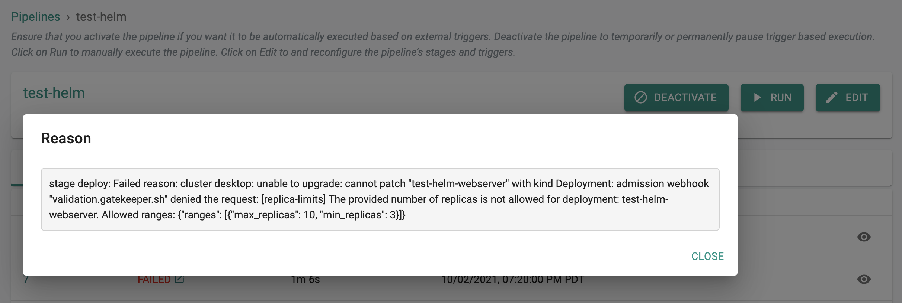

## What Will You Do

This is part 9 in a multi-part workshop.  In this part, you will create a Kubernetes policy in your project and enforce it on all cluster in your project. You will deploy a workload out of compliance with the policy and notice that it is blocked from deployment to the cluster. 

**Estimated Time**

Estimated time burden for this part is 15 minutes. 

---

## Step 1: Setup Workload 

One of the key benefits of using OPA Gatekeeper for policy management is that in addition to enforcing policies during "admission" to the Kubernetes cluster, it can also be used to determine which k8s resources "already existing" on the cluster are "out of compliance" with policy. 

In this step, we will ensure we deploy a workload from [Part-7](part7.md) with a specific number of replicas that will be out of compliance with our policy. We will use this to show how you can identify resources in violation of policy. 

- Ensure that the "replicaCount" in the values.yaml file is set to "2" 

```yaml hl_lines="5"
# Default values for webserver.
# This is a YAML-formatted file.
# Declare variables to be passed into your templates.

replicaCount: 2

nginx:
  name: frontend
  image:
```

On your cluster, when you kubectl in the workload's namespace, you should see something like the following. 

```
kubectl get po -n first

NAME                                   READY   STATUS    RESTARTS   AGE
test-helm-webserver-77585694cc-29vtc   2/2     Running   11         10s
test-helm-webserver-77585694cc-qkvjd   2/2     Running   11         10s
```

---

## Step 2: Constraint Template

You can have as many policies as you want in a Project in an Org. An OPA policy comprises one or many OPA Gatekeeper constraints. In this step, we will create a custom constrain template which will require all "k8s deployments" deployed on the cluster to have a "Replica Count" within the "specified limit". 

**Constraint Template**

- Save the [YAML File](template_min_max_pods.yaml) on your laptop
- In your project, navigate to OPA Gatekeeper -> Constraint Templates 
- Althought a number of templates are provided out of the box, we want to create a custom template
- Click on new template
- Enter "k8sreplicalimits" and select "upload file" for artifact sync
- Upload the YAML file you saved above



!!! Important
    Ensure that the name you provide for the template matches the name in the YAML file


```yaml
apiVersion: templates.gatekeeper.sh/v1beta1
kind: ConstraintTemplate
metadata:
  name: k8sreplicalimits
  annotations:
    description: Requires a number of replicas to be set for a deployment between a min and max value.
spec:
  crd:
    spec:
      names:
        kind: k8sreplicalimits
      validation:
        # Schema for the `parameters` field
        openAPIV3Schema:
          type: object
          properties:
            ranges:
              type: array
              items:
                type: object
                properties:
                  min_replicas:
                    type: integer
                  max_replicas:
                    type: integer
  targets:
    - target: admission.k8s.gatekeeper.sh
      rego: |
        package k8sreplicalimits
        deployment_name = input.review.object.metadata.name
        violation[{"msg": msg}] {
          spec := input.review.object.spec
          not input_replica_limit(spec)
          msg := sprintf("The provided number of replicas is not allowed for deployment: %v. Allowed ranges: %v", [deployment_name, input.parameters])
        }
        input_replica_limit(spec) {
          provided := input.review.object.spec.replicas
          count(input.parameters.ranges) > 0
          range := input.parameters.ranges[_]
          value_within_range(range, provided)
        }
        value_within_range(range, value) {
          range.min_replicas <= value
          range.max_replicas >= value
        }
```

---

## Step 3: Constraint

In this step, we will create a "custom constraint" based on the "constraint template" from the previous step. This constraint allows you to "define/specify" a MIN and MAX replicas for all deployments on your cluster. 

- Download the [YAML File](constraint_mix_max_pod.yaml) to your laptop
- Navigate to OPA Gatekeeper -> Constraints 
- Click on new constraint
- Enter "replica-limits" and select "upload file" for artifact sync
- Upload the YAML file you saved above

!!! Important
    Ensure that the name you provide for the constraint matches the name in the YAML file





``` yaml hl_lines="12 13"
apiVersion: constraints.gatekeeper.sh/v1beta1
kind: k8sreplicalimits
metadata:
  name: replica-limits
spec:
  match:
    kinds:
      - apiGroups: ["apps"]
        kinds: ["Deployment"]
  parameters:
    ranges:
    - min_replicas: 3
      max_replicas: 10
```

---

## Step 4: Policy

A policy comprises at least one constraints (default and/or custom) and optional exclusions. 

- Navigate to OPA Gatekeeper -> Policy 
- Click on new Policy, provide a name and Save
- Provide a version (alphanumeric is ok)
- Select the "replica-limits" constraint from the dropdown and Save 



---

## Step 5: Cluster Blueprint 

In the previous step, you created a policy comprising OPA Gatekeeper constraints. Now, you will include this policy in a "custom cluster blueprint" and apply it to your cluster. This step will be very similar to what you did in [Part 5](part5.md).

!!! Important
    You can use the same cluster blueprint for multiple clusters achieving project and org wide standardization and compliance.

- Navigate to Infrastructure -> Blueprints
- Create a new blueprint and provide a name (e.g. opa)
- Click on new version
- Select "minimal" for base blueprint
- Select "Enable OPA Gatekeeper", select the "OPA policy" and version we created in the previous step and Sav



Navigate to your cluster and apply the "OPA" custom cluster blueprint on the cluster. In a few minutes, all required components for OPA Gatekeeper and the constraints will become operational on your cluster. 



Optionally, you can also use kubectl to look at the OPA gatekeeper resources on the cluster

```yaml hl_lines="6 7 8 9"
kubectl get po -n rafay-system

NAME                                             READY   STATUS    RESTARTS   AGE
controller-manager-868759489b-f6xpg              1/1     Running   30         35h
edge-client-75d456497-78tqp                      1/1     Running   1          35h
gatekeeper-audit-69d75d695c-rwnnd                1/1     Running   0          28h
gatekeeper-controller-manager-59fb975495-rvnks   1/1     Running   0          25s
gatekeeper-controller-manager-59fb975495-x2fpw   1/1     Running   0          25s
gatekeeper-controller-manager-59fb975495-zj5dg   1/1     Running   0          25s
rafay-connector-6c6c4f67cf-m5c6n                 1/1     Running   44         35h
relay-agent-7bb69f58c4-5chgc                     1/1     Running   1          35h
velero-dk6wpm1-desktop-55f57589ff-x6nf8          1/1     Running   0          23h
```

To check if the OPA gatekeeper "constraints" we specified in the policy are operational on the cluster. As you can see from the results, OPA Gatekeeper was automatically deployed to the cluster with configuration from the policy we specified. 

```
kubectl get constraints

NAME             AGE
replica-limits   5m
```

--- 

## Step 6: Policy Violations

- Navigate to Home -> System -> Audit Logs
- Select the OPA tab
- Select the project and your cluster name (e.g. desktop project, desktop cluster)

This will perform a real time retrieval of "policy violations" already existing on the selected cluster and display the results to the administrator. In our example, we can see that it is reporting that our pre-existing workload has deployments that violate our policy. A logical approach will be for security administrators to work with the workload owners to remediate the violations. 



---

## Step 7: New Deployments

In this step, we will see what workload owners will experience if they try to deploy a new workload or update an existing workload that is not in compliance with the configured policy in the cluster blueprint. 

- Navigate to your Git repo and update the "replicaCount" in the values.yaml file to "1" 
- The GitOps pipeline will pick up the changes and attempt to deploy to the remote cluster
- The pipeline job will fail because the specs are "not in compliance" with the configured policy. Workload owners will be presented with a friendly error message as in the example shown below.



---

## Recap

Congratulations! At this point, you have successfully created a policy and tested enforcement on your Kubernetes cluster. 

---
