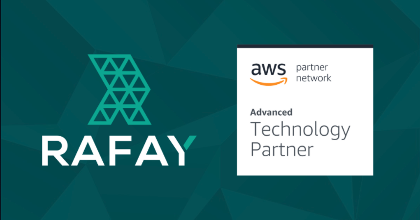

# Rafay Kubernetes Operations Platform Workshop

### Welcome

Welcome to the multi-cluster Kubernetes operations workshop hosted by Rafay. This self-paced workshop is an introduction to automating and centralizing Amazon EKS lifecycle operations with Rafay’s Kubernetes Operations Platform. Cloud operations, DevOps engineers, site reliability engineers (SREs), or other infrastructure leads will learn a practical approach to managing Amazon EKS clusters.

By the end of this workshop, you’ll be able to:

- Automate provisioning of new Amazon EKS clusters and import existing clusters for centralized operations.
- Create centralized policy configurations to ensure consistency of Amazon EKS clusters being managed across an enterprise.
- Provide fleet-wide zero-trust access and auditing for all Amazon EKS clusters streamlining RBAC and support for corp identity / cloud credentials.
- Instantly monitor and analyze health, utilization, and user-level activities across all Amazon EKS clusters. 

### Pre-Requisites
- Familiarity with Kubernetes and Amazon EKS.
- Access to a Github account that you can download and update configuration files with. 
- Access to a Rafay account and Amazon Console. Signup for a free trial [here](https://rafay.co/start/).
